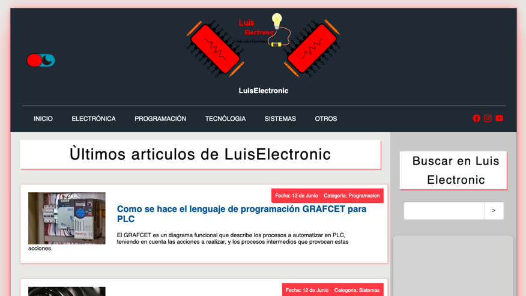

# Information Blog

## Table of contents

- [Overview](#overview)
  - [The challenge](#the-challenge)
  - [Screenshot](#screenshot)
- [My process](#my-process)
  - [Built with](#built-with)
  - [What I learned](#what-i-learned)
  - [Continued development](#continued-development)
- [Author](#author)

## Overview

This page is no longer online.

### The challenge

Users should be able to:

- View the page from any device
- Navigate between the categories of the navbar
- Enter each item to read a full description
- View the page in dark mode if required

### Screenshot

## My process

### Built with

- HTML
- CSS
- JavaScript

### What I learned

On this page, a fully functional engineering blog was made in which I learned how to implement an SEO to appear in the first places of Google, in addition to learning how to upload a project to a hosting with its respective domain for track information through Google Analitys. Finally I learned to index each of the pages and integrate a sitemap so that the google robots can identify the pages more quickly.

### Continued development

On this page you could continue developing the implementation of some animations and the integration of google ads.

## Author

Luis David Jimenez Martinez
- Portfolio - [www.luisdavidjm.com](https://www.luisdavidjm.com)
- GitHub - [LuisDavidJM](https://github.com/LuisDavidJM)
